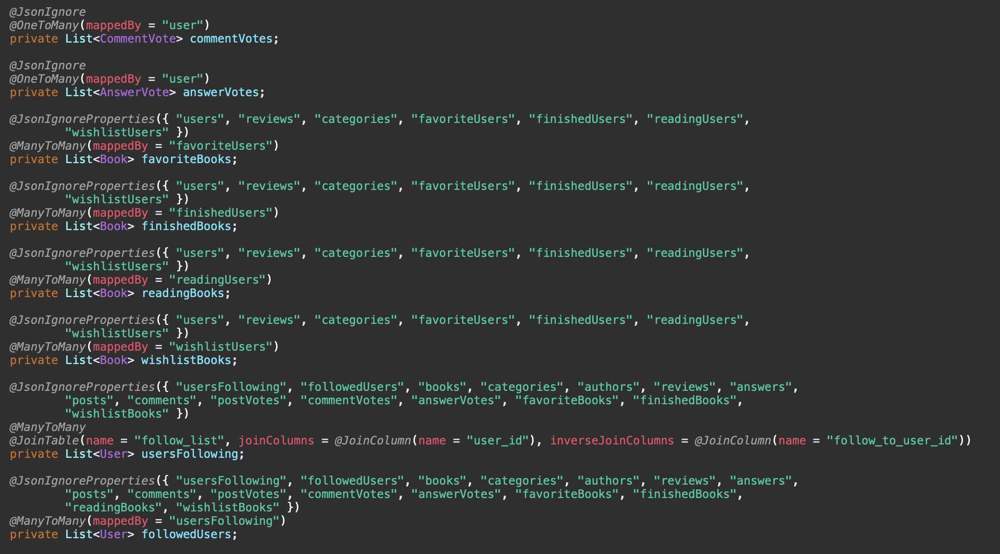
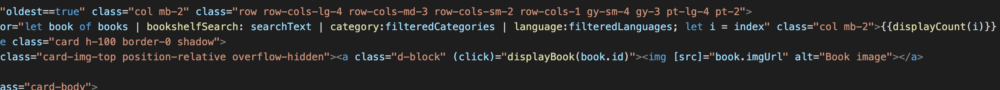
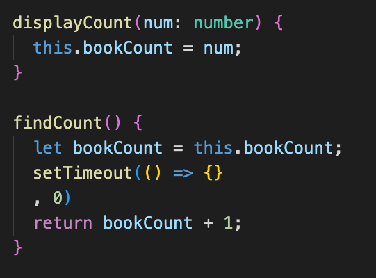
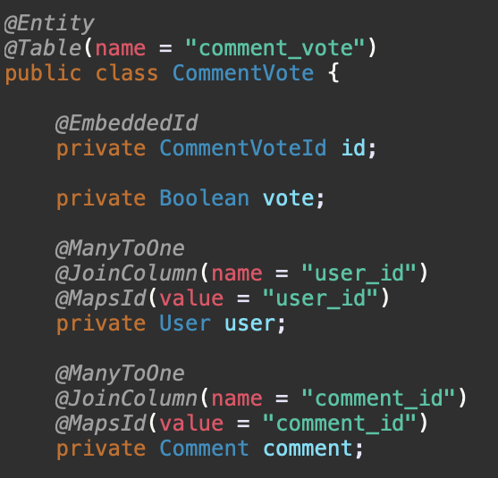
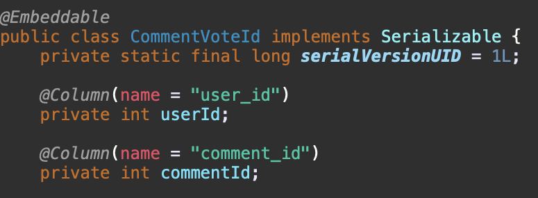
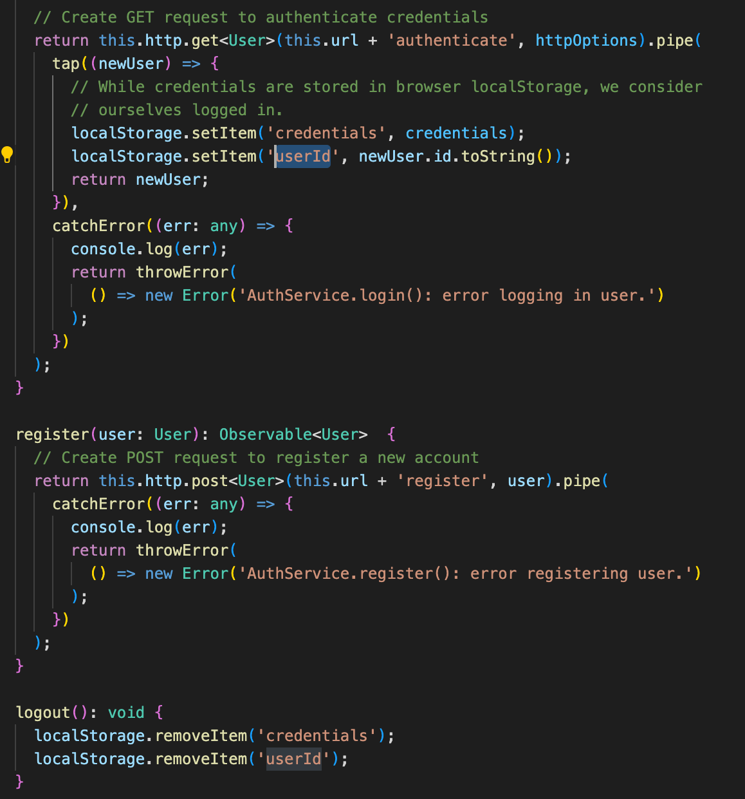
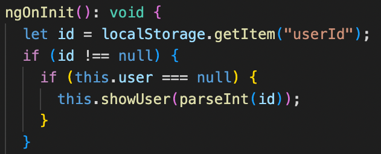
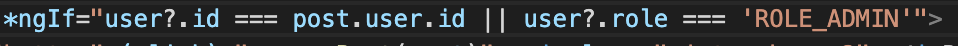

# BookNook

## Overview

The BookNook project is a helpful tool for book enthusiasts to interact socially with one another and find information about their books in an active library. There are two vital sections of the site. The "Bookshelf" section of the site is an elaborate library that can be searched with multiple filters and keywords to narrow down a book a user might be looking for. The "Nook" section of the site is an interactive social page. Users can make posts, comment on posts, and see the top posts on the site. This social interaction can help book enthusiasts connect in ways that are far more convenient than using other platforms to find those groups of individuals.

This project was created in a 9 day sprint. During those 9 days, the developers attempted to implement as many features as possible in a fun, interactive, well-styled, and efficient way.

#### Bookshelf

The bookshelf is an elaborate library that can be searched with multiple filters and keywords. These can be used to narrow down what book a user might be interested in finding. Users can search by keyword, and that keyword will filter based on the book's title, description, author, or ISBN. If a user is interested in seeing the works of an author they enjoy, they can enter the author's name into the search bar and find other books they have written. If a user is interested in searching for books surrounding a particular keyword, they can enter the keyword into the search bar and it will show book titles and descriptions that match it.

The bookshelf also uses filters that run concurrently with the search bar. A user can filter by genre, language, and a page count range. A user might want to read a book that is only in the comedy and horror genres, they can select both in the Genre dropdown menu and both comedy and horror books will appear. A user can filter books that are a particular language. A user can set a range for the pages in a book. A user might want to read a book that is not more than 500 pages long. The user can enter 500 into the maximum page count field and books with under 500 pages will appear.

In this site, there is a social interaction between users that include following users. On the bookshelf, if a user you are following have labelled one of the books in your search as a book they are currently reading, you will see that they are reading that book at the bottom of the card.

#### Book Page

The book page for a specific book has multiple uses for our users. It does not just display the book's information, but can be directly interacted with in the community. A user can add a book to their wishlist, favorites books, currently reading book list, and finished reading book list. The favorite book function can be reversed when the book is favorited, so a user can unfavorite the book when clicking the button again. When a user adds a book to one of their lists, the button is deactivated to indicate that it has been added to that list.

A user can leave a review of a book on the book's page. A list of the reviews are displayed and can be interacted with live. The review header will display the average review rating and will show a detailed bar for each star rating, visually displaying the ratings.

#### Nook

The Nook is an interactive social environment. Users can make a post, comment on that post, and make a reply to those comments. The more interaction a post receives, the more likely it will appear in the "Popular Posts" featured section. Users can follow other users on this page, clicking the follow button next to the user's name. They can also unfollow that user on that same page. This social page is imperative for the purpose of the site, which is to enable social interaction for book enthusiasts.

#### User Profile

A user can interact with individual books in multiple ways. They can add the book to their wishlist, favorite books, currently reading book list, and finished reading book list. Not only can the user interact with these features on the book page, but it can be accessed on the user profile. The user can also interact with a list of their existing posts on this page. A user can update or enter their personal information into the page.

There are multiple lists related to books that the user can interact with. These lists include the wishlist, favorite books list, currently reading book list, and finished reading book list.

- A book should be added to the wishlist when a user desires reading the book and has not read it yet.
- A book should be added to the favorite books list when a user enjoys a book enough to want others to know that the book was a favorite of theirs.
- A book should be added to the currently reading book list when a user is actively reading the book.
- A book should be added to the finished reading book list when a user completed the book and wants to display to others that it is a book they finished.

You can interact with these books by removing them from the list. A user can also refer to the books in their list by clicking on the book card and it will display the book's page. All of the interactions on this page are live, so the list will update them moment anything is removed.

## Technologies Used

**Backend**

- Java
- JPA
- MySQL
- Gradle
- XML
- Hibernate
- RESTful API

**Frontend**

- Angular
- JavaScript
- TypeScript
- HTML
- CSS
- Bootstrap 5
- JSON

**Hosting**

- Tomcat
- AWS
- MAMP

**Assisting**

- Postman
- MySQLWorkbench
- SpringToolSuite4 (Eclipse)
- Visual Studio Code
- Atom

**Communication**

- Zoom
- Discord
- Slack

## Lessons Learned

The developers ran into difficult concepts and problems throughout the creation of BookNook. Though most of them were resolved, it taught the team an immense amount of lessons that will be used in future projects.

The team had to learn how to utilize @JsonIgnoreProperties properly for the entities and their foreign keys. It was imperative to use this annotation to prevent recursion when parsing data into JSON. This challenged the team to think a few steps ahead in their use of the data being sent to the server. What was needed, and what wasn't needed? We were able to tackle this question and apply the annotation where it was needed.

Attempting to have a variable that is changed live based on the filters used in the *ngFor used for the bookshelf proved to be far more difficult than anticipated. The variable would be read before changed, which caused the result count to only display the previous data, not the updated data. To fix this, the team had to use setTimeout in the JavaScript to delay the program from reading the variable before changing it.

 

The team had not yet tackled the challenge of creating separate entities for tables that had individual columns, rather than just join columns. We had to learn how to use the @MapsId annotation and map the tables correctly for use in the application.

 

There was no reference point for users that were logged in currently to the site, so the team had to learn how to set items into the browser's local storage, and retrieve that data whenever a user is logged in.

 

The team learned that checking for administrative permissions and granting different operations than a normal user was something that could be implemented in the view of the code. Using *ngIf statements, we were able to implement those functions with ease.

## About The Team

## Database Design

## RESTful API Mapping
